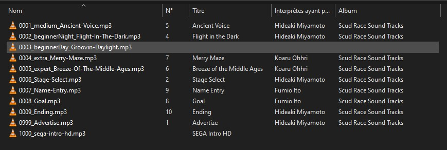
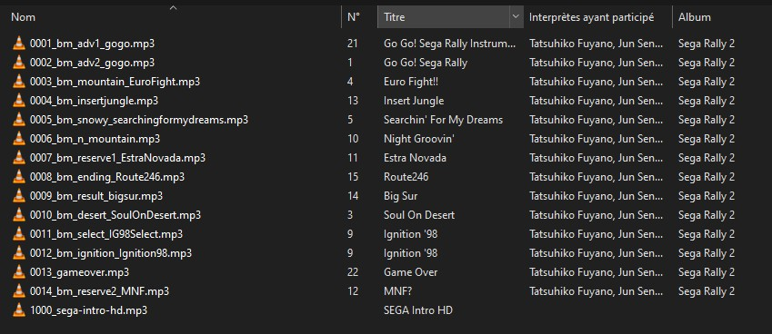
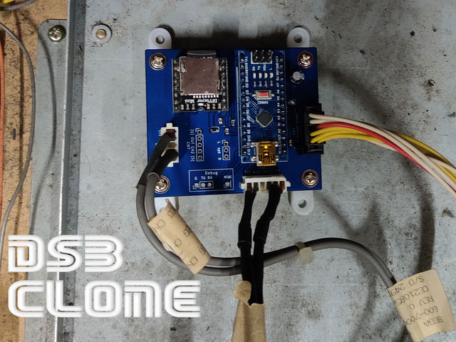

# Universal DSB
This is a replacement board for the SEGA Model 1 sound Board, Digital Sound Boards 1 and 2 used on several SEGA arcade games.
This is a fork of the Rolel's (Rom1) DSBClone project, which continued a Proof Of Concept that I had done in 2009.

# Historical background

1992: SEGA Model 1 and Model 2 games PCB hasn't integrated sound boards. The "Model 1 sound Board" was used to produce sounds and its optionnal board for musics. The music is stored in maskroms specific to each game. It is a card separate from the main stack of the game.
* First version (DSB1):
  * Virtua Fighter (Model 1)
  * Virtua Racing (Model 1)
  * Wing Wars (Model 1)
  * Star Wars Arcade (Model 1) for speech and effects
  * Daytona USA (Model 2)
  * Desert Tank (Model 2)
  * Virtua Cop (Model 2)

SEGA also use the "Model 1 sound board" (without optionnal board) for BMG (BackGround Musics) on:    
  * Sega Rally Deluxe
  * Manx TT Deluxe

1993: SEGA digital sound Board (DSB1) work on the same principle and are dedicated to playing music on many SEGA games:  
  * Star Wars Arcade (Model 1) for musics
  * Sega Touring Cars (Model 2C)
  * Scud Race / Super GT (Model 3)

1996: SEGA digital sound Board 2 (DSB2) was able to play better quality musics on:
  * Daytona 2 (Model 3)
  * Lost World (Model 3)
  * Sega Rally 2 (Model 3)
  * Spikeout (Model 3)
  * Spikeout FE (Model 3)
  * Star Wars Trilogy (Model 3)
  * Top Skater (Model 3)

# Features

* Playback of MP3 and WAV files stored on a microSD card
* Plug'n'Play: no modification of the wiring
* Track listing can be modified simply by renumbering the files
* Output volume identical to the original DSB
* Reprogrammable firmware: based on an Arduino Nano
* 24-bit DAC, DR 90dB, SNR 85 dB
* Protection by fuse and polarizers on the connectors
* 2 audio outputs with "JST SEGA" connector

In comparison with the original card:
* There is a slight latency (a few milliseconds) when starting the music. This can be understood if you pay attention with a twin that contains a DSB Sega and a DSB Clone. We can play on the MP3 to reset everything, or simply put two clones.
* The sound quality is much better: high quality MP3 (320kbps) / WAV replace the original 112kbits MPEG2.
* Possibility to customize the game's BGMs.

# Build from sources

Guide to build from sources is available in [Docs/Build.md](Docs/Build.md)

# Updating from release

Update procedure can be found in [Docs/Update.md](Docs/Update.md).

# Releases

Public releases can be found in the [Releases](Releases/) folder. Update procedure can be found in [Docs/Update.md](Docs/Update.md) documentation.

The "-debug.hex" releases have debugging enabled. You can hook a RS232 adapter to the debug pin on the board (default 115200bps, 8 data bits, 0 parity bit).

Public releases:

* 2021-08-29: 
  * Fix a bug on fadeout. 
  * Improvements on latency by filtering spam sent by games to the player.
* 2022-04-02: 
  * Change fadeout behavior; sound volume is now restored after fade.
  * Latency of MP3 player is tested on start; this improves latency.
* 2022-04-03:
  * Fix intro sound not being played on some MP3 players.
  * Fix advertisement BGM on Scud Race.
* 2022-04-05:
  * Fix a case where sound effects would affect BGM.
* 2022-04-06:
  * Reverted advertisement BGM played by DSB on Scud Race.
  * Track looping now working on Scud Race.
* 2022-04-16:
  * Track loop bugfix for Scud Race.
* 2022-12-04:
  * Removed support of DSB1 command set as they conflict with some DSB2 games.

# Installation

1. Prepare the SD card.

Any microSD card will do: between 60 and 150MB of space is sufficient. If you have an old 128 or 256MB card that's fine.

The audio files are to be placed in the "MP3" directory located at the root. Each file is preceded by 4 digits corresponding to the track number.
Bonus: the "1000_xxx.mp3" file is automatically read when the card is started. A cool way to have a jingle, music on hold, etc. Personally I put the "SEGAAAA" jingle 

 

Several packs corresponding to the most common games are available. Here are those currently known:
* Sega Rally 2, CD quality from OST: https://segaretro.org/Sega_Rally_2_(album)
* Scud Race, CD quality from OST: https://segaretro.org/Scud_Race_Sound_Tracks
* Daytona2, CD quality from OST: https://segaretro.org/Daytona_USA_2_Sound_Tracks
* VirtuaRacing, dump arcade from Khinsider VGM
* In progress: Virtua Fighter, CD quality from OST: https://segaretro.org/Virtua_Fighter_&_Virtua_Fighter_2_Music_Tracks
* Numbers: all numbers from 1 to 100. This allows you to know which track is requested by the game without needing a computer.

As they are copyrighted materials they are not shared.

2. Connect to the arcade cabinet

It's plug'n'play without modifying the wiring:
* the black 10 pin socket for the power supply
* the 6-pin white socket for MIDI
* the white 5-pin socket(s) for the audio outputs

# Ready to use board

You can buy a ready to use board on arcade forums like [Neo-Arcadia](https://www.neo-arcadia.com/forum/viewtopic.php?f=9&t=75510) (French) or [Arcade Projects](https://www.arcade-projects.com/threads/dsb-clone-digital-sound-board-sega.17832/) (English).
